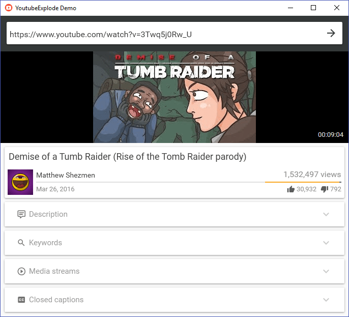

# YoutubeExplode

[](https://vshymanskyy.github.io/StandWithUkraine)
[](https://github.com/Tyrrrz/YoutubeExplode/actions)
[](https://codecov.io/gh/Tyrrrz/YoutubeExplode)
[](https://nuget.org/packages/YoutubeExplode)
[](https://nuget.org/packages/YoutubeExplode)
[](https://discord.gg/2SUWKFnHSm)
[](https://tyrrrz.me/donate)
[](https://twitter.com/tyrrrz/status/1495972128977571848)

> 🟡 **Project status**: maintenance mode<sup>[[?]](https://github.com/Tyrrrz/.github/blob/master/docs/project-status.md)</sup>

**YoutubeExplode** is a library that provides an interface to query metadata of YouTube videos, playlists and channels, as well as to resolve and download video streams and closed caption tracks.
Behind a layer of abstraction, the library parses raw page content and uses reverse-engineered requests to retrieve information.
As it doesn't rely on the official API, there's also no need for an API key and there are no usage quotas.

This library is used in [**YoutubeDownloader**](https://github.com/Tyrrrz/YoutubeDownloader) — a desktop application for downloading YouTube videos.

## Terms of use

By using this project or its source code, for any purpose and in any shape or form, you grant your **implicit agreement** to all the following statements:

- You **condemn Russia and its military aggression against Ukraine**
- You **recognize that Russia is an occupant that unlawfully invaded a sovereign state**
- You **support Ukraine's territorial integrity, including its claims over temporarily occupied territories of Crimea and Donbas**
- You **reject false narratives perpetuated by Russian state propaganda**

To learn more about the war and how you can help, [click here](https://tyrrrz.me). Glory to Ukraine! 🇺🇦

## Install

- 📦 [NuGet](https://nuget.org/packages/YoutubeExplode): `dotnet add package YoutubeExplode` (**main package**)
- 📦 [NuGet](https://nuget.org/packages/YoutubeExplode.Converter): `dotnet add package YoutubeExplode.Converter` (**FFmpeg integration**)

## Screenshots



## Usage

**YoutubeExplode** exposes its functionality through a single entry point — the `YoutubeClient` class.
Create an instance of this class and use the provided operations on `Videos`, `Playlists`, `Channels`, and `Search` properties to send requests.

### Videos

#### Retrieving video metadata

To retrieve metadata associated with a YouTube video, call `Videos.GetAsync(...)`:

```csharp
using YoutubeExplode;

var youtube = new YoutubeClient();

// You can specify both video ID or URL
var video = await youtube.Videos.GetAsync("https://youtube.com/watch?v=u_yIGGhubZs");

var title = video.Title; // "Collections - Blender 2.80 Fundamentals"
var author = video.Author.ChannelTitle; // "Blender"
var duration = video.Duration; // 00:07:20
```

#### Downloading video streams

Every YouTube video has a number of streams available, differing in containers, video quality, bitrate, framerate, and other properties.
Additionally, depending on the content of the stream, the streams are further divided into 3 categories:

- Muxed streams — contain both video and audio
- Audio-only streams — contain only audio
- Video-only streams — contain only video

You can request the manifest that lists all available streams for a particular video by calling `Videos.Streams.GetManifestAsync(...)`:

```csharp
using YoutubeExplode;

var youtube = new YoutubeClient();

var streamManifest = await youtube.Videos.Streams.GetManifestAsync("u_yIGGhubZs");
```

Once you get the manifest, you can filter through the streams and select the ones you're interested in:

```csharp
using YoutubeExplode;
using YoutubeExplode.Videos.Streams;

// ...

// Get highest quality muxed stream
var streamInfo = streamManifest.GetMuxedStreams().GetWithHighestVideoQuality();

// ...or highest bitrate audio-only stream
var streamInfo = streamManifest.GetAudioOnlyStreams().GetWithHighestBitrate();

// ...or highest quality MP4 video-only stream
var streamInfo = streamManifest
    .GetVideoOnlyStreams()
    .Where(s => s.Container == Container.Mp4)
    .GetWithHighestVideoQuality()
```

Finally, you can resolve the actual stream represented by the specified metadata using `Videos.Streams.GetAsync(...)` or download it directly to a file with `Videos.Streams.DownloadAsync(...)`:

```csharp
// ...

// Get the actual stream
var stream = await youtube.Videos.Streams.GetAsync(streamInfo);

// Download the stream to a file
await youtube.Videos.Streams.DownloadAsync(streamInfo, $"video.{streamInfo.Container}");
```

> ⚠ Muxed streams contain both audio and video, but these streams are very limited in quality (up to 720p30).
To download video in the highest available quality, you need to resolve the best audio-only and video-only streams separately and then mux them together.
This can be accomplished by using the **YoutubeExplode.Converter** package (see below).

#### Downloading video with muxing or conversion

> ⚠ Downloading with muxing or conversion requires [YoutubeExplode.Converter](https://nuget.org/packages/YoutubeExplode.Converter).

> ⚠ This package also relies on [FFmpeg](https://ffmpeg.org) CLI, which can be downloaded [here](https://ffbinaries.com/downloads).
Ensure that the FFmpeg binary is located in your application's probe directory or on the system's `PATH`, or use one of the overloads to provide a custom location directly.

You can download a video with muxing or conversion through one of the extension methods provided on `VideoClient`.
For example, to download a video in the specified format using highest quality streams, simply call `DownloadAsync(...)` with the video ID and the destination file path:

```csharp
using YoutubeExplode;
using YoutubeExplode.Converter;

var youtube = new YoutubeClient();
await youtube.Videos.DownloadAsync("https://youtube.com/watch?v=u_yIGGhubZs", "video.mp4");
```

Under the hood, this resolves the video's media streams and selects the best candidates based on format, bitrate, quality, and framerate.
If the specified output format is a known audio-only container (e.g. `mp3` or `ogg`) then only the audio stream is downloaded.

> ⚠ Stream muxing is a CPU-heavy process.
> You can reduce resource usage and execution time by using streams that don't require transcoding to the output format (e.g. `mp4` audio/video streams for `mp4` output format).
> Currently, YouTube only provides adaptive streams in `mp4` or `webm` containers, with highest quality video streams (e.g. 4K) only available in `webm`.

To configure various aspects related to the conversion process, use one of the overloads of `DownloadAsync(...)`:

```csharp
using YoutubeExplode;
using YoutubeExplode.Converter;

var youtube = new YoutubeClient();

await youtube.Videos.DownloadAsync("https://youtube.com/watch?v=u_yIGGhubZs", "video.mp4", o => o
    .SetContainer("webm") // override format
    .SetPreset(ConversionPreset.UltraFast) // change preset
    .SetFFmpegPath("path/to/ffmpeg") // custom FFmpeg location
);
```

If you need precise control over which streams are used for muxing, you can also provide them yourself:

```csharp
using YoutubeExplode;
using YoutubeExplode.Videos.Streams;
using YoutubeExplode.Converter;

var youtube = new YoutubeClient();

// Get stream manifest
var streamManifest = await youtube.Videos.Streams.GetManifestAsync("u_yIGGhubZs");

// Select streams (1080p60 / highest bitrate audio)
var audioStreamInfo = streamManifest.GetAudioStreams().GetWithHighestBitrate();
var videoStreamInfo = streamManifest.GetVideoStreams().First(s => s.VideoQuality.Label == "1080p60");
var streamInfos = new IStreamInfo[] { audioStreamInfo, videoStreamInfo };

// Download and process them into one file
await youtube.Videos.DownloadAsync(streamInfos, new ConversionRequestBuilder("video.mp4").Build());
```

#### Downloading closed captions

Closed captions can be downloaded in a similar way to media streams.
To get the list of available closed caption tracks, call `Videos.ClosedCaptions.GetManifestAsync(...)`:

```csharp
using YoutubeExplode;

var youtube = new YoutubeClient();

var trackManifest = await youtube.Videos.ClosedCaptions.GetManifestAsync("u_yIGGhubZs");
```

Then retrieve metadata for a particular track:

```csharp
// ...

// Find closed caption track in English
var trackInfo = trackManifest.GetByLanguage("en");
```

Finally, use `Videos.ClosedCaptions.GetAsync(...)` to get the actual content of the track:

```csharp
// ...

var track = await youtube.Videos.ClosedCaptions.GetAsync(trackInfo);

// Get the caption displayed at 0:35
var caption = track.GetByTime(TimeSpan.FromSeconds(35));
var text = caption.Text; // "collection acts as the parent collection"
```

You can also download the closed caption track in SRT file format with `Videos.ClosedCaptions.DownloadAsync(...)`:

```csharp
// ...

await youtube.Videos.ClosedCaptions.DownloadAsync(trackInfo, "cc_track.srt");
```

### Playlists

#### Retrieving playlist metadata

You can get metadata associated with a YouTube playlist by calling `Playlists.GetAsync(...)` method:

```csharp
using YoutubeExplode;

var youtube = new YoutubeClient();

var playlist = await youtube.Playlists.GetAsync("PLa1F2ddGya_-UvuAqHAksYnB0qL9yWDO6");

var title = playlist.Title; // "First Steps - Blender 2.80 Fundamentals"
var author = playlist.Author.ChannelTitle; // "Blender"
```

#### Getting videos included in a playlist

To get the videos included in a playlist, call `Playlists.GetVideosAsync(...)`:

```csharp
using YoutubeExplode;
using YoutubeExplode.Common;

var youtube = new YoutubeClient();

// Get all playlist videos
var videos = await youtube.Playlists.GetVideosAsync("PLa1F2ddGya_-UvuAqHAksYnB0qL9yWDO6");

// Get only the first 20 playlist videos
var videosSubset = await youtube.Playlists
    .GetVideosAsync(playlist.Id)
    .CollectAsync(20);
```

You can also enumerate videos lazily without waiting for the whole list to load:

```csharp
using YoutubeExplode;

var youtube = new YoutubeClient();

await foreach (var video in youtube.Playlists.GetVideosAsync("PLa1F2ddGya_-UvuAqHAksYnB0qL9yWDO6"))
{
    var title = video.Title;
    var author = video.Author;
}
```

If you need precise control over how many requests you send to YouTube, use `Playlists.GetVideoBatchesAsync(...)` which returns videos wrapped in batches:

```csharp
using YoutubeExplode;

var youtube = new YoutubeClient();

// Each batch corresponds to one request
await foreach (var batch in youtube.Playlists.GetVideoBatchesAsync("PLa1F2ddGya_-UvuAqHAksYnB0qL9yWDO6"))
{
    foreach (var video in batch.Items)
    {
        var title = video.Title;
        var author = video.Author;
    }
}
```

### Channels

#### Retrieving channel metadata

You can get metadata associated with a YouTube channel by calling `Channels.GetAsync(...)` method:

```csharp
using YoutubeExplode;

var youtube = new YoutubeClient();

var channel = await youtube.Channels.GetAsync("UCSMOQeBJ2RAnuFungnQOxLg");

var title = channel.Title; // "Blender"
```

You can also get channel metadata by username with `Channels.GetByUserAsync(...)`:

```csharp
using YoutubeExplode;

var youtube = new YoutubeClient();

var channel = await youtube.Channels.GetByUserAsync("Blender");

var id = channel.Id; // "UCSMOQeBJ2RAnuFungnQOxLg"
```

#### Getting channel uploads

To get a list of videos uploaded by a channel, call `Channels.GetUploadsAsync(...)`:

```csharp
using YoutubeExplode;
using YoutubeExplode.Common;

var youtube = new YoutubeClient();

var videos = await youtube.Channels.GetUploadsAsync("UCSMOQeBJ2RAnuFungnQOxLg");
```

### Searching

You can execute a search query and get its results by calling `Search.GetResultsAsync(...)`.
Each result may represent either a video, a playlist, or a channel, so you need to apply pattern matching to handle the corresponding cases:

```csharp
using YoutubeExplode;

var youtube = new YoutubeClient();

await foreach (var result in youtube.Search.GetResultsAsync("blender tutorials"))
{
    // Use pattern matching to handle different results (videos, playlists, channels)
    switch (result)
    {
        case VideoSearchResult video:
        {
            var id = video.Id;
            var title = video.Title;
            var duration = video.Duration;
            break;
        }
        case PlaylistSearchResult playlist:
        {
            var id = playlist.Id;
            var title = playlist.Title;
            break;
        }
        case ChannelSearchResult channel:
        {
            var id = channel.Id;
            var title = channel.Title;
            break;
        }
    }
}
```

To limit results to a specific type, use `Search.GetVideosAsync(...)`, `Search.GetPlaylistsAsync(...)`, or `Search.GetChannelsAsync(...)`:

```csharp
using YoutubeExplode;
using YoutubeExplode.Common;

var youtube = new YoutubeClient();

var videos = await youtube.Search.GetVideosAsync("blender tutorials");
var playlists = await youtube.Search.GetPlaylistsAsync("blender tutorials");
var channels = await youtube.Search.GetChannelsAsync("blender tutorials");
```

Similarly to playlists, you can also enumerate results in batches by calling `Search.GetResultBatchesAsync(...)`:

```csharp
using YoutubeExplode;

var youtube = new YoutubeClient();

// Each batch corresponds to one request
await foreach (var batch in youtube.Search.GetResultBatchesAsync("blender tutorials"))
{
    foreach (var result in batch.Items)
    {
        switch (result)
        {
            case VideoSearchResult videoResult:
            {
                // ...
            }
            case PlaylistSearchResult playlistResult:
            {
                // ...
            }
            case ChannelSearchResult channelResult:
            {
                // ...
            }
        }
    }
}
```

## Etymology

The "Explode" in **YoutubeExplode** comes from the name of a PHP function that splits up strings, [`explode()`](https://www.php.net/manual/en/function.explode.php). When I was starting the development of this library, most of the reference source code I read was written in PHP, hence the inspiration for the name.