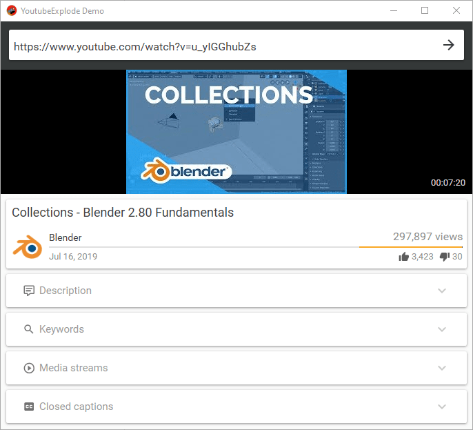

# YoutubeExplode

[](https://github.com/Tyrrrz/.github/blob/master/docs/project-status.md)
[](https://tyrrrz.me/ukraine)
[](https://github.com/Tyrrrz/YoutubeExplode/actions)
[](https://codecov.io/gh/Tyrrrz/YoutubeExplode)
[](https://nuget.org/packages/YoutubeExplode)
[](https://nuget.org/packages/YoutubeExplode)
[](https://discord.gg/2SUWKFnHSm)
[](https://twitter.com/tyrrrz/status/1495972128977571848)

<table>
    <tr>
        <td width="99999" align="center">Development of this project is entirely funded by the community. <b><a href="https://tyrrrz.me/donate">Consider donating to support!</a></b></td>
    </tr>
</table>

<p align="center">
    
</p>

**YoutubeExplode** is a library that provides an interface to query metadata of YouTube videos, playlists and channels, as well as to resolve and download video streams and closed caption tracks.
Behind a layer of abstraction, this library works by scraping raw page data and exploiting reverse-engineered internal endpoints.

> 📝 Interested in the inner workings of this library?
> See the [Reverse-Engineering YouTube](https://tyrrrz.me/blog/reverse-engineering-youtube-revisited) article.

**Extension packages**:

- [YoutubeExplode.Converter](YoutubeExplode.Converter) — provides an interface to download and convert videos using FFmpeg

## Terms of use<sup>[[?]](https://github.com/Tyrrrz/.github/blob/master/docs/why-so-political.md)</sup>

By using this project or its source code, for any purpose and in any shape or form, you grant your **implicit agreement** to all the following statements:

- You **condemn Russia and its military aggression against Ukraine**
- You **recognize that Russia is an occupant that unlawfully invaded a sovereign state**
- You **support Ukraine's territorial integrity, including its claims over temporarily occupied territories of Crimea and Donbas**
- You **reject false narratives perpetuated by Russian state propaganda**

To learn more about the war and how you can help, [click here](https://tyrrrz.me/ukraine). Glory to Ukraine! 🇺🇦

## Install

- 📦 [NuGet](https://nuget.org/packages/YoutubeExplode): `dotnet add package YoutubeExplode`

## Screenshots



## Usage

**YoutubeExplode** exposes its functionality through a single entry point — the `YoutubeClient` class.
Create an instance of this class and use the provided operations on `Videos`, `Playlists`, `Channels`, and `Search` properties to send requests.

### Videos

#### Retrieving video metadata

To retrieve the metadata associated with a YouTube video, call `Videos.GetAsync(...)`:

```csharp
using YoutubeExplode;

using var youtube = new YoutubeClient();

// You can specify either the video URL or its ID
var videoUrl = "https://youtube.com/watch?v=u_yIGGhubZs";
var video = await youtube.Videos.GetAsync(videoUrl);

var title = video.Title; // "Collections - Blender 2.80 Fundamentals"
var author = video.Author.ChannelTitle; // "Blender"
var duration = video.Duration; // 00:07:20
```

#### Downloading video streams

Every YouTube video has a number of streams available, differing in containers, video quality, bitrate, framerate, and other parameters.
Additionally, the streams are further divided into 3 categories based on their content:

- ~~Muxed streams — contain both video and audio~~ (no longer provided by YouTube)
- Audio-only streams — contain only audio
- Video-only streams — contain only video

> [!WARNING]
> Muxed streams contain both audio and video, but these streams are limited in quality (up to 720p30).
> To download the video in the highest available quality, you will need to resolve the best audio-only and video-only streams separately and then mux them together.
> The muxing process can be performed using FFmpeg with the help of the [**YoutubeExplode.Converter**](YoutubeExplode.Converter) package.

> [!WARNING]
> Muxed streams are deprecated by YouTube and are not guaranteed to be available for every video.
> If possible, avoid relying on them too much and instead perform muxing manually using the provided audio-only and video-only streams.

You can request the manifest that lists all available streams for a particular video by calling `Videos.Streams.GetManifestAsync(...)`:

```csharp
using YoutubeExplode;

using var youtube = new YoutubeClient();

var videoUrl = "https://youtube.com/watch?v=u_yIGGhubZs";
var streamManifest = await youtube.Videos.Streams.GetManifestAsync(videoUrl);
```

Once the manifest is obtained, you can filter through the streams and identify the ones you're interested in:

```csharp
using YoutubeExplode;
using YoutubeExplode.Videos.Streams;

// ...

// Get the highest bitrate audio-only stream
var streamInfo = streamManifest.GetAudioOnlyStreams().GetWithHighestBitrate();

// ...or the highest quality MP4 video-only stream
var streamInfo = streamManifest
    .GetVideoOnlyStreams()
    .Where(s => s.Container == Container.Mp4)
    .GetWithHighestVideoQuality()
```

Finally, you can resolve the actual stream represented by the specified metadata using `Videos.Streams.GetAsync(...)` or download it directly to a file with `Videos.Streams.DownloadAsync(...)`:

```csharp
// ...

// Get the actual stream
var stream = await youtube.Videos.Streams.GetAsync(streamInfo);

// Download the stream to a file
await youtube.Videos.Streams.DownloadAsync(streamInfo, $"video.{streamInfo.Container}");
```

> [!WARNING]
> While the `Url` property in the stream metadata can be used to access the underlying content, you need a series of carefully crafted HTTP requests in order to do so.
> It's highly recommended to use `Videos.Streams.GetAsync(...)` or `Videos.Streams.DownloadAsync(...)` instead, as they will perform all the heavy lifting for you.

#### Downloading closed captions

Closed captions can be downloaded in a similar way to media streams.
To get the list of available closed caption tracks, call `Videos.ClosedCaptions.GetManifestAsync(...)`:

```csharp
using YoutubeExplode;

using var youtube = new YoutubeClient();

var videoUrl = "https://youtube.com/watch?v=u_yIGGhubZs";
var trackManifest = await youtube.Videos.ClosedCaptions.GetManifestAsync(videoUrl);
```

Then retrieve the metadata for a particular track:

```csharp
// ...

// Find closed caption track in English
var trackInfo = trackManifest.GetByLanguage("en");
```

Finally, use `Videos.ClosedCaptions.GetAsync(...)` to get the actual content of the track:

```csharp
// ...

var track = await youtube.Videos.ClosedCaptions.GetAsync(trackInfo);

// Get the caption displayed at 0:35
var caption = track.GetByTime(TimeSpan.FromSeconds(35));
var text = caption.Text; // "collection acts as the parent collection"
```

You can also download the closed caption track in the SRT file format with `Videos.ClosedCaptions.DownloadAsync(...)`:

```csharp
// ...

await youtube.Videos.ClosedCaptions.DownloadAsync(trackInfo, "cc_track.srt");
```

### Playlists

#### Retrieving playlist metadata

You can get the metadata associated with a YouTube playlist by calling the `Playlists.GetAsync(...)` method:

```csharp
using YoutubeExplode;

using var youtube = new YoutubeClient();

var playlistUrl = "https://youtube.com/playlist?list=PLa1F2ddGya_-UvuAqHAksYnB0qL9yWDO6";
var playlist = await youtube.Playlists.GetAsync(playlistUrl);

var title = playlist.Title; // "First Steps - Blender 2.80 Fundamentals"
var author = playlist.Author.ChannelTitle; // "Blender"
```

#### Retrieving videos included in a playlist

To get the videos included in a playlist, call `Playlists.GetVideosAsync(...)`:

```csharp
using YoutubeExplode;
using YoutubeExplode.Common;

using var youtube = new YoutubeClient();
var playlistUrl = "https://youtube.com/playlist?list=PLa1F2ddGya_-UvuAqHAksYnB0qL9yWDO6";

// Get all playlist videos
var videos = await youtube.Playlists.GetVideosAsync(playlistUrl);

// Get only the first 20 playlist videos
var videosSubset = await youtube.Playlists.GetVideosAsync(playlistUrl).CollectAsync(20);
```

You can also enumerate the videos iteratively without waiting for the whole list to load:

```csharp
using YoutubeExplode;

using var youtube = new YoutubeClient();
var playlistUrl = "https://youtube.com/playlist?list=PLa1F2ddGya_-UvuAqHAksYnB0qL9yWDO6";

await foreach (var video in youtube.Playlists.GetVideosAsync(playlistUrl))
{
    var title = video.Title;
    var author = video.Author;
}
```

If you need precise control over how many requests you send to YouTube, use `Playlists.GetVideoBatchesAsync(...)` which returns videos wrapped in batches:

```csharp
using YoutubeExplode;

using var youtube = new YoutubeClient();
var playlistUrl = "https://youtube.com/playlist?list=PLa1F2ddGya_-UvuAqHAksYnB0qL9yWDO6";

// Each batch corresponds to one request
await foreach (var batch in youtube.Playlists.GetVideoBatchesAsync(playlistUrl))
{
    foreach (var video in batch.Items)
    {
        var title = video.Title;
        var author = video.Author;
    }
}
```

> [!NOTE]
> You can craft playlist IDs to fetch special auto-generated playlists, such as music mixes, popular channel uploads, liked videos, and more.
> See [this reference](https://wiki.archiveteam.org/index.php/YouTube/Technical_details#Playlists) for more information.

### Channels

#### Retrieving channel metadata

You can get the metadata associated with a YouTube channel by calling the `Channels.GetAsync(...)` method:

```csharp
using YoutubeExplode;

using var youtube = new YoutubeClient();

var channelUrl = "https://youtube.com/channel/UCSMOQeBJ2RAnuFungnQOxLg";
var channel = await youtube.Channels.GetAsync(channelUrl);

var title = channel.Title; // "Blender"
```

You can also get the channel metadata by username or profile URL with `Channels.GetByUserAsync(...)`:

```csharp
using YoutubeExplode;

using var youtube = new YoutubeClient();

var channelUrl = "https://youtube.com/user/BlenderFoundation";
var channel = await youtube.Channels.GetByUserAsync(channelUrl);

var id = channel.Id; // "UCSMOQeBJ2RAnuFungnQOxLg"
```

To get the channel metadata by slug or legacy custom URL, use `Channels.GetBySlugAsync(...)`:

```csharp
using YoutubeExplode;

using var youtube = new YoutubeClient();

var channelUrl = "https://youtube.com/c/BlenderFoundation";
var channel = await youtube.Channels.GetBySlugAsync(channelUrl);

var id = channel.Id; // "UCSMOQeBJ2RAnuFungnQOxLg"
```

To get the channel metadata by handle or custom URL, use `Channels.GetByHandleAsync(...)`:

```csharp
using YoutubeExplode;

using var youtube = new YoutubeClient();

var channelUrl = "https://youtube.com/@BlenderOfficial";
var channel = await youtube.Channels.GetByHandleAsync(channelUrl);

var id = channel.Id; // "UCSMOQeBJ2RAnuFungnQOxLg"
```

#### Retrieving channel uploads

To get the list of videos uploaded by a channel, call `Channels.GetUploadsAsync(...)`:

```csharp
using YoutubeExplode;
using YoutubeExplode.Common;

using var youtube = new YoutubeClient();
var channelUrl = "https://youtube.com/channel/UCSMOQeBJ2RAnuFungnQOxLg";

var videos = await youtube.Channels.GetUploadsAsync(channelUrl);
```

### Search

You can execute a search query by calling the `Search.GetResultsAsync(...)` method.
Each search result may represent either a video, a playlist, or a channel, so you need to apply pattern matching to handle the corresponding cases:

```csharp
using YoutubeExplode;

using var youtube = new YoutubeClient();

await foreach (var result in youtube.Search.GetResultsAsync("blender tutorials"))
{
    // Use pattern matching to handle different results (videos, playlists, channels)
    switch (result)
    {
        case VideoSearchResult video:
        {
            var id = video.Id;
            var title = video.Title;
            var duration = video.Duration;
            break;
        }
        case PlaylistSearchResult playlist:
        {
            var id = playlist.Id;
            var title = playlist.Title;
            break;
        }
        case ChannelSearchResult channel:
        {
            var id = channel.Id;
            var title = channel.Title;
            break;
        }
    }
}
```

To limit the results to a specific type, use `Search.GetVideosAsync(...)`, `Search.GetPlaylistsAsync(...)`, or `Search.GetChannelsAsync(...)`:

```csharp
using YoutubeExplode;
using YoutubeExplode.Common;

using var youtube = new YoutubeClient();

var videos = await youtube.Search.GetVideosAsync("blender tutorials");
var playlists = await youtube.Search.GetPlaylistsAsync("blender tutorials");
var channels = await youtube.Search.GetChannelsAsync("blender tutorials");
```

Similarly to playlists, you can also enumerate results in batches by calling `Search.GetResultBatchesAsync(...)`:

```csharp
using YoutubeExplode;

using var youtube = new YoutubeClient();

// Each batch corresponds to one request
await foreach (var batch in youtube.Search.GetResultBatchesAsync("blender tutorials"))
{
    foreach (var result in batch.Items)
    {
        switch (result)
        {
            case VideoSearchResult videoResult:
            {
                // ...
            }
            case PlaylistSearchResult playlistResult:
            {
                // ...
            }
            case ChannelSearchResult channelResult:
            {
                // ...
            }
        }
    }
}
```

### Authentication

You can access private videos and playlists by providing cookies that correspond to a pre-authenticated YouTube account.
To do that, create an instance of `YoutubeClient` using a constructor that accepts `IReadOnlyList<Cookie>`:

```csharp
using YoutubeExplode;

// Perform authentication and extract cookies
var cookies = ...;

// Cookie collection must be of type IReadOnlyList<System.Net.Cookie>
using var youtube = new YoutubeClient(cookies);
```

In order to actually perform the authentication, you can use an embedded browser such as [WebView](https://nuget.org/packages/Microsoft.Web.WebView2) to navigate the user to the [YouTube login page](https://accounts.google.com/ServiceLogin?continue=https%3A%2F%2Fwww.youtube.com), let them log in, and then extract the cookies from the browser.

## Etymology

The "Explode" in **YoutubeExplode** comes from the name of a PHP function that splits up strings, [`explode(...)`](https://php.net/manual/en/function.explode.php). When I was starting the development of this library, most of the reference source code I read was written in PHP, hence the inspiration for the name.
